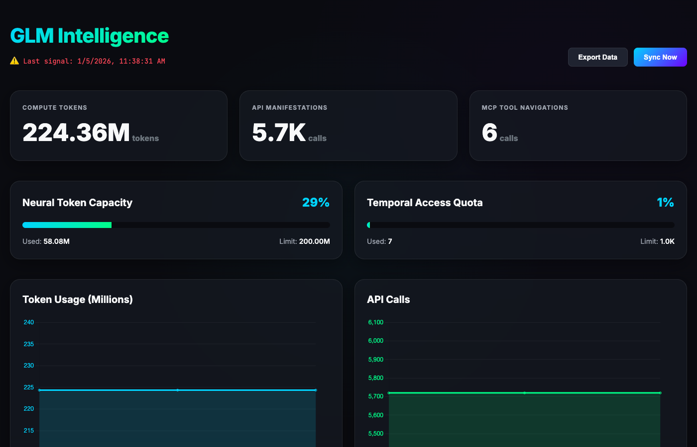

# @dustinober/glm-monitor

A professional dashboard for monitoring your GLM Coding Plan API usage and quotas. Track tokens, model calls, MCP tool usage, and quota limits in real-time.



## Features

- 📊 **Real-time metrics** - Tokens, model calls, and MCP tool usage
- 📈 **Historical charts** - 24-hour data retention with auto-refresh
- ⚠️ **Quota alerts** - Visual warnings when approaching limits
- 🔄 **Auto-refresh** - Dashboard updates every 30 seconds
- 💾 **Persistent storage** - Data survives restarts
- 📤 **Export** - Download data as CSV

## Installation

### Option 1: Global Install (Recommended)

```bash
npm install -g @dustinober/glm-monitor
```

This installs the `glm-monitor` CLI tool globally, available from anywhere.

### Option 2: Project Install

```bash
git clone <repo-url>
cd glm-monitor
npm install
```

## Quick Start

### 1. Initialize Configuration

```bash
# If globally installed
glm-monitor init

# Or if using project directly
npx @dustinober/glm-monitor init
```

You can also set your token explicitly:

```bash
glm-monitor init -t "YOUR_AUTH_TOKEN_HERE"
```

### 2. Open Dashboard

```bash
# Automatically collects data, then opens dashboard
npm start

# Or using the CLI:
glm-monitor start
```

The dashboard opens at `http://localhost:8080` (or `http://localhost:5173` in dev mode).

**Data Collection:**
- `npm start` / `glm-monitor start`: Collects fresh data before opening.
- `npm run monitor`: Collects data and opens dashboard.
- Use `--no-collect` to skip collection: `glm-monitor start --no-collect`

## Dashboard Interface Guide

The dashboard provides a comprehensive view of your usage:

### 1. Usage Overview Cards
Located at the top, these cards show your aggregate usage:
- **Compute Tokens**: Total tokens consumed with trend indicator.
- **API Manifestations**: Total number of model calls.
- **MCP Tool Navigations**: Count of tool invocations (e.g., search, web-reader).

### 2. Quota Status
Color-coded indicators show your current standing against limits:
- **Neural Token Capacity** (5-hour rolling):
    - 🟢 **Green (<50%)**: Healthy usage.
    - 🟡 **Yellow (50-80%)**: Approaching limit.
    - 🔴 **Red (>80%)**: Critical usage.
- **Temporal Access Quota** (monthly): Monitor your long-term consumption.

### 3. Usage Trend Chart
The central chart visualizes usage over the last 24 hours:
- **Left Axis (Bars)**: Token usage in millions.
- **Right Axis (Line)**: Model calls.
- **Data Points**: Hover over any bar to see precise timestamped data.
- **Auto-Update**: The chart refreshes automatically every 30 seconds.

## Automation

Set up automatic data collection to keep your history complete without manual intervention.

### macOS (launchd)

Create `~/Library/LaunchAgents/com.user.usage-monitor.plist`:

```xml
<?xml version="1.0" encoding="UTF-8"?>
<!DOCTYPE plist PUBLIC "-//Apple//DTD PLIST 1.0//EN" "http://www.apple.com/DTDs/PropertyList-1.0.dtd">
<plist version="1.0">
<dict>
  <key>Label</key>
  <string>com.user.usage-monitor</string>
  <key>ProgramArguments</key>
  <array>
    <string>/usr/local/bin/npm</string>
    <string>run</string>
    <string>collect</string>
  </array>
  <key>WorkingDirectory</key>
  <string>/path/to/GLM_Dashboard</string>
  <key>StartInterval</key>
  <integer>300</integer>
</dict>
</plist>
```

Load with:
```bash
launchctl load ~/Library/LaunchAgents/com.user.usage-monitor.plist
```

### Linux (cron)

Open crontab:
```bash
crontab -e
```

Add the following line to run every 5 minutes:
```bash
*/5 * * * * cd /path/to/GLM_Dashboard && npm run collect
```

## Data Storage & Configuration

### Data Locations
| Location | Purpose |
|----------|---------|
| `~/.glm-monitor/usage-history.json` | Persistent data storage (24h retention) |
| `~/.glm-monitor/config.json` | Auth token and API settings |

### Environment Variables
You can override configuration using environment variables:

```bash
export ANTHROPIC_BASE_URL="https://api.z.ai/api/anthropic"
export ANTHROPIC_AUTH_TOKEN="your-token-here"
```

## API Endpoints

The collector queries these GLM Monitoring API endpoints:

| Endpoint | Purpose |
|----------|---------|
| `/api/monitor/usage/model-usage` | Token and call statistics |
| `/api/monitor/usage/tool-usage` | MCP tool invocation counts |
| `/api/monitor/usage/quota/limit` | Current quota limits and usage |

## Troubleshooting

### "token expired or incorrect"
Your auth token has expired. Re-initialize:
```bash
glm-monitor init -t "YOUR_NEW_TOKEN"
```

### No data showing in dashboard
1. Run `npm run collect` to fetch initial data.
2. Verify `~/.glm-monitor/usage-history.json` exists.
3. Check browser console for errors.

### Charts not updating
1. Click the **"Sync Now"** button to manually refresh.
2. Dashboard auto-refreshes every 30 seconds.
3. Verify data file is being updated: `ls -la ~/.glm-monitor/`

## License

MIT
